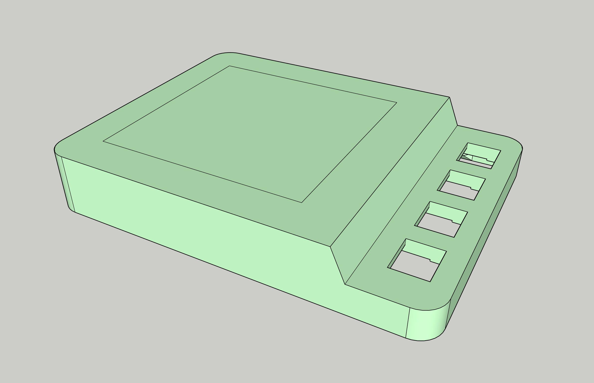
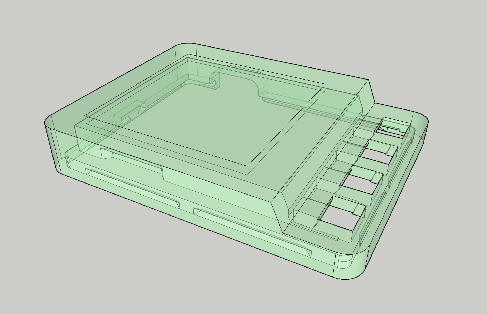
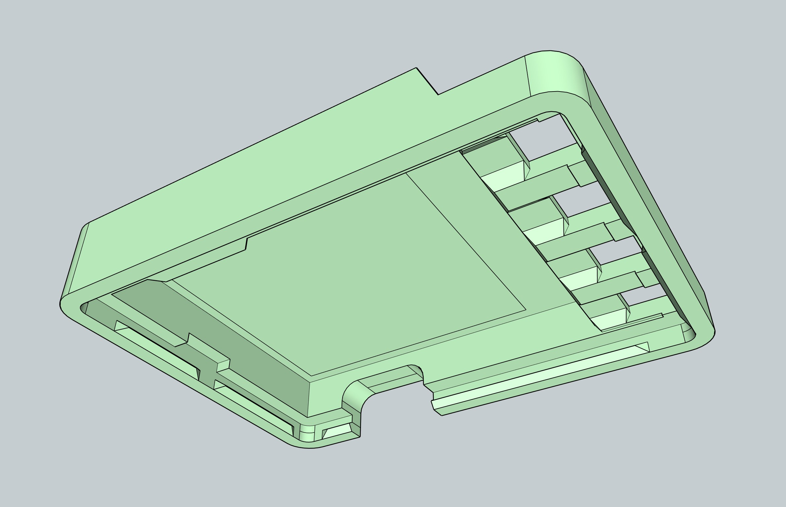
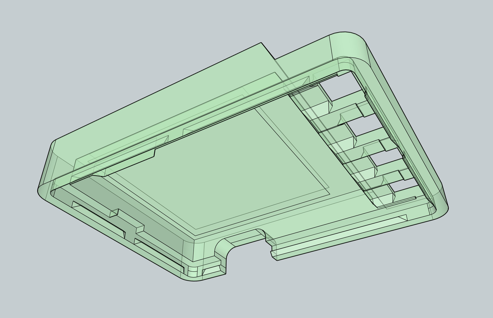

Firefly Pixie: Case
===================

Clam Shell
----------

A simple two-part case, meant to be easy to assemble and mass
produce, providing full protection to the PCB, display and buttons.

Harness
-------

The harness is meant to be the simplest MVP of cases, designed to
be easy to assemble and disassemble to swap out boards, replace
screens and test basic components like the buttons and USB-C port
for durability.

It provides sufficient protection to the PCB, display and buttons
for development purposes.

  
  

  
  

