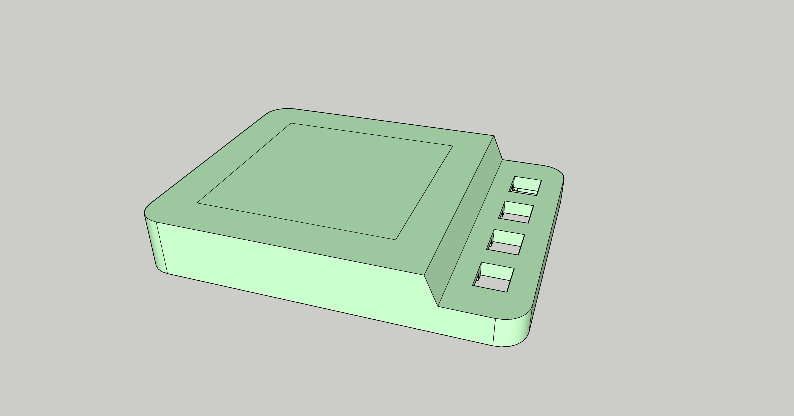
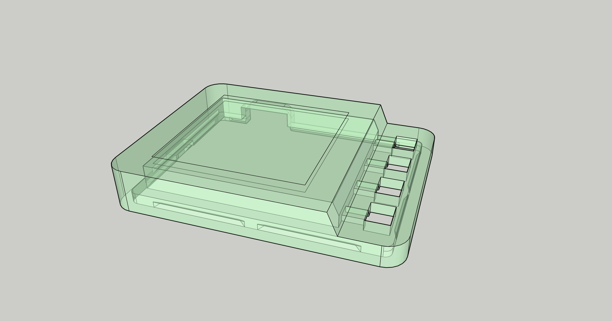
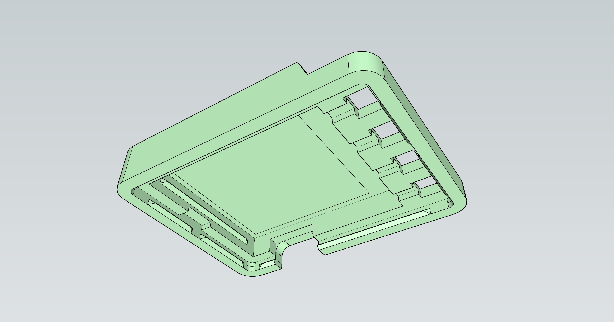
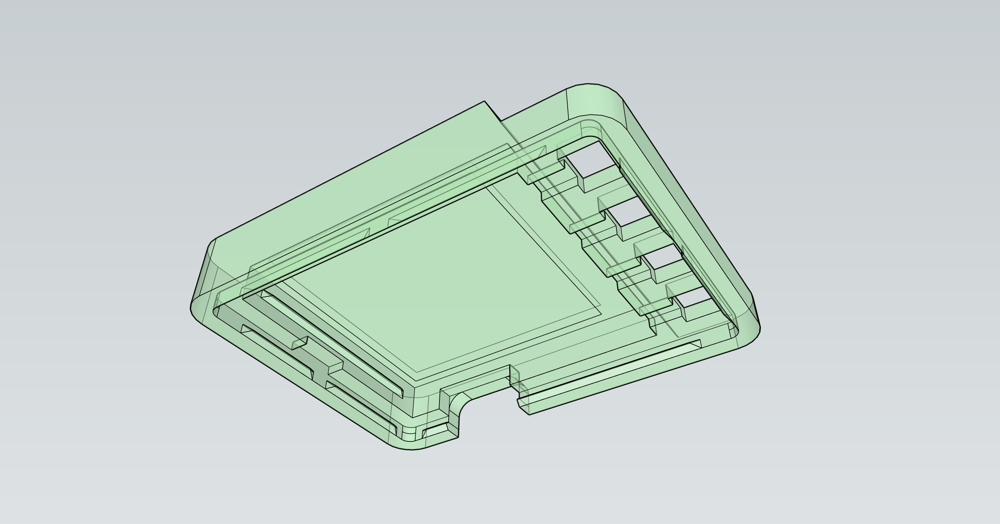

Pixie Harness
=============

The Harness is a simple snap-fit case designed to provide minimum
viable protection and operation for devlopers to work with the
device until a more firm case can be designed.

The hardness is 3D printed in 8001 clear resin and snap-fits the
LCD and PCB.

Renders
-------

  
  

  
  

